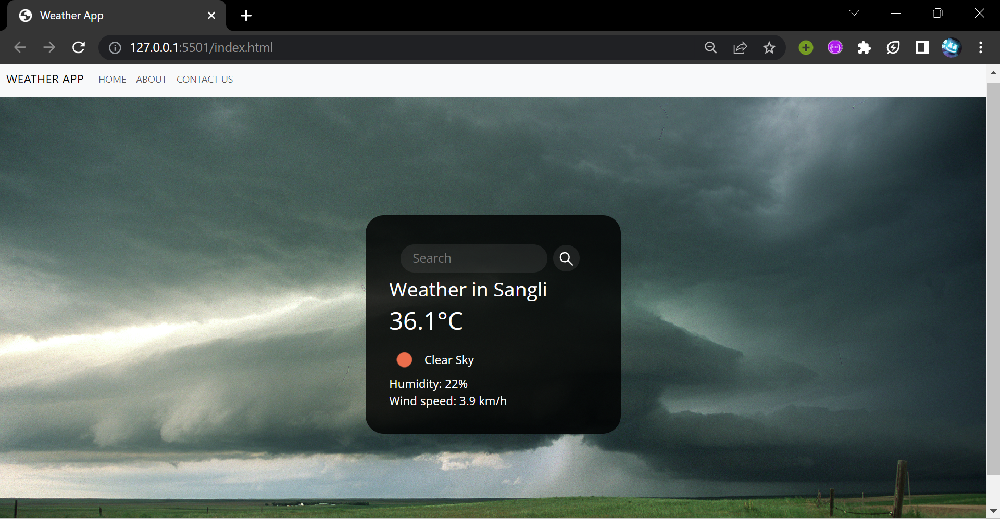

# Weather App

The Weather App is a web application that provides real-time weather information for a given city. It allows users to enter a city name and view the current weather conditions, including temperature, humidity, wind speed, and weather description.

## Features

- **Home Page**: The home page of the app displays a search input field where users can enter the name of a city. After submitting the form, the app fetches the weather data for that city and displays it on the page.
- **Weather Information**: The app retrieves weather data from a weather API and presents it to the user. The information includes the current temperature, humidity, wind speed, and a brief description of the weather conditions.
- **About Page**: The about page provides information about the developer of the app.

## Technologies Used

- HTML
- CSS
- JavaScript
- Weather API (e.g., OpenWeatherMap)

## Installation and Setup

1. Clone the repository:

2. Open the project in a code editor of your choice.

3. Obtain an API key from a weather API provider (e.g., OpenWeatherMap).

4. In the JavaScript file (`script.js`), replace `<YOUR_API_KEY>` with your actual API key.

5. Save the changes.

## Usage

1. Open the `index.html` file in a web browser.

2. Enter the name of a city in the search input field and press Enter or click the search button.

3. The app will fetch weather data for the entered city and display it on the page.

4. Explore the different pages of the app, including the home page and the about page, to learn more about the weather and the developer.

## Contributing

Contributions are welcome! If you have any suggestions, improvements, or bug fixes, please feel free to open an issue or submit a pull request.

# Weather App

